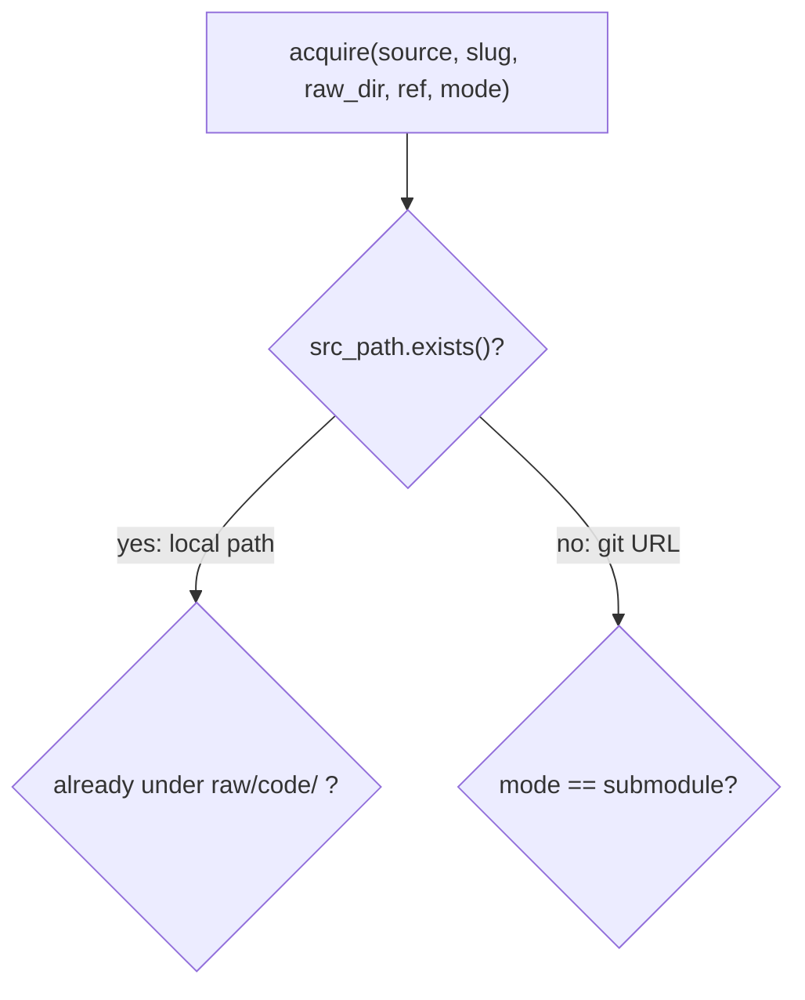

# wikify-repo

**Compile any codebase into a knowledge-base wiki your AI agent can actually trust.**


**wikify-repo** turns a repository into a grounded, lint-clean
[Karpathy-style LLM markdown wiki](https://gist.github.com/karpathy/442a6bf555914893e9891c11519de94f):
every claim on every page cites a real, compiler-resolved symbol, and a citation linter fails the build
if one doesn't check out. No graph database, no dashboard, no hosted service — the output is plain
markdown in your own git repo, and your agent answers from it with nothing but `grep`. A deterministic
tool does the grounding (SCIP symbol graph, packets, citation lint, coverage); one LLM-in-the-loop step
writes the prose. Record every class, method and relationship with SCIP, spend the model on the ~20% of
the code that explains ~80% of it, and give the rest a deterministic catalog page so nothing is dropped.

**For:** teams running coding agents on a codebase too large to read; knowledge bases that span many
repositories; onboarding without a tour guide.

[](https://vlasenkoalexey.github.io/wikify-repo-demo/tools/graph/)
<sub>A wiki produced by this tool — two ingested codebases plus prose pages, every link a citation. Click for the [interactive view](https://vlasenkoalexey.github.io/wikify-repo-demo/tools/graph/).</sub>

## 30 seconds

```bash
pipx install git+https://github.com/vlasenkoalexey/wikify-repo && wikify setup   # CLI + agent skill
cd my-repo && wikify init                # wiki config + a block in CLAUDE.md / AGENTS.md
```

Then, in your agent session (Claude Code, Codex, or Antigravity): **"wikify this repo"**.
Many repos in one wiki instead? See [Two ways to run it](#two-ways-to-run-it).

## What you get

- **Mechanism pages** for each subsystem — overview, design rationale, and a step-by-step mechanism
  with citations woven in.
- **Diagrams that are claims, not decoration** — a system-level architecture diagram in the overview
  and a Mermaid mechanism diagram on every page (flowchart, sequence, state or class, chosen by the
  question), each with a legend mapping every node to a catalog symbol, checked at build time.
- **A symbol index for every symbol** — one greppable row per symbol (anchor, path, line, kind, rank, body
  hash, callers, citing pages) plus a complete caller-edge list and a module map — so the whole repo is
  represented, by set-difference over the symbol table, not by what the model chose to visit. Per-module
  catalog pages are an opt-in rendering of it for repos whose source is not on disk.
- **Area pages** — one per top-level area, saying what it is for and which units it holds — the hop between
  the overview and a mechanism page; the prose budget is a per-unit rule, not a page cap.
- **An overview** that maps questions and tasks to pages: the front door for agents and humans.
- **A hard gate**: the citation linter fails the build on any claim that does not resolve to a real
  symbol; **adversarial verify** then tries to refute every load-bearing claim against the source.
- **Incremental by construction**: pin a commit, and a version bump rebuilds only the pages whose cited
  symbols changed, relinks the ones that merely moved, and re-verifies only the claims whose evidence
  changed. `changes/<ref>.md` records what changed between versions and why, in the authors' words.
- **Cross-repo concept pages** that link the same idea across every ingested repo.
- **Trust you can read**: OKF v0.2 front matter (`generated`, `verified`, `sources`) tells any reader
  which pages a tool verified and which a human reviewed.
- **Plain markdown**: retrieval is `grep` plus `index.md`. No embeddings, no database, no server.

## What a page looks like

From a real page in the survey wiki (wikify documenting its own `acquire` stage; prose and diagram
verbatim, trimmed — the legend line shows the form pages built with 0.2 carry under every diagram):

````markdown
## Overview
`acquire` is the very first thing every wikify pipeline command (`prepare`, `finalize`, `plan`) does,
and it is the provenance foundation the rest of the grounded wiki rests on. Its job is deceptively
small: turn a `source` string — a local path or a git URL — into an on-disk source tree at a known,
recorded commit SHA, returned as an [`Acquired`](../catalog/wikify/acquire.md#Acquired) record.
Everything downstream is meaningful only because the tree it points into is pinned.

## Diagram

Legend:
- `A` — [`acquire`](../catalog/wikify/acquire.md#acquire)
````

Every `catalog/…#Symbol` link resolves to a catalog entry with the symbol's signature, docstring and a
link to the exact source line at the pinned commit. If it didn't, the build would have failed.

## Proof

Measured on a 150k-line PyTorch TPU backend (C++ via Bazel plus Python) and in the survey:

| | |
|---|---|
| Symbols represented | 11,536 of 11,536 — every symbol has an index row |
| Mechanism pages / citations | 27 pages, 691 citations, all resolving to pinned source lines |
| Adversarial verify | 39 of 329 load-bearing claims refuted and fixed before the wiki shipped |
| Head-to-head with openwiki on the same repo | wikify pages named 111–183 symbols each; openwiki's code pages named 1–8 ([analysis](https://github.com/vlasenkoalexey/codebase-cartography-wiki/blob/main/wiki/notes/torch-tpu-ingest-tool-choice.md)) |
| Survey | 12 code-comprehension tools ingested and compared from their own grounded wikis |

## How wikify-repo compares

Five tools that turn a codebase into something an agent can read, scored on one yardstick: **can an
agent trust what it retrieves?** Rows are the axes that decide it; every cell comes from the tool's own
source, ingested and compared in the [survey](https://github.com/vlasenkoalexey/codebase-cartography-wiki).

| | [**wikify-repo**](https://github.com/vlasenkoalexey/wikify-repo) | [openwiki](https://github.com/langchain-ai/openwiki) | [graphify](https://github.com/Graphify-Labs/graphify) | [understand-anything](https://github.com/Egonex-AI/Understand-Anything) | [Google Code Wiki](https://developers.googleblog.com/introducing-code-wiki-accelerating-your-code-understanding/) |
|---|---|---|---|---|---|
| **Specialization** | Grounded markdown wiki you own — for trusted agent retrieval | Agent-written docs — an LLM reads the repo and writes the pages | Multi-modal knowledge graph (code + docs + media) | Visual codebase onboarding — explore it as a graph | Zero-setup hosted docs for public repos |
| **Output** | ✅ Markdown wiki — pages in your git repo | ✅ Markdown docs — pages in your git repo | ➖ Knowledge graph (HTML + JSON) | ➖ React-Flow graph dashboard | ❌ Hosted web docs only |
| **Code structure from** | ✅ **SCIP** — compiler-grade symbol resolution (scip-python / scip-clang). **Full semantic mapping** | ❌ **nothing** — no parser at all; the LLM reads source with filesystem + shell tools | ➖ tree-sitter AST, **name-based** (20 languages). Syntactic mapping. | ➖ tree-sitter AST, **name-based**. Syntactic mapping. | ❔ Gemini (closed) |
| **Faithfulness** | ✅ **Citation linter is a hard build gate**; uncited → `[!inferred]` | ➖ **claims sidecar** — per-page claims cite line ranges with content hashes, re-checked when the evidence drifts; the prose itself is not gated, and there is no symbol index | ➖ `EXTRACTED / INFERRED / AMBIGUOUS` labels — honest, not gated | ❌ LLM per-node summaries, unverified | ❌ *"AI-generated map, not a source of truth"* |
| **Coverage** | ✅ **Deterministic set-difference** — every module gets a page | ❔ whatever the agent chooses to visit — unbounded | ➖ Leiden community clustering | ➖ analyzes discovered files — no stated completeness | ❔ not specified |
| **Inputs** | ➖ code + prose (docs / articles) | ➖ code repos only | ✅ **widest** — code, SQL, shell, docs, papers, images, audio/video | ➖ code + docs / LLM-wikis | ➖ code repos only |
| **Retrieval** | ✅ `grep` + `index.md` — **no embeddings, no DB, no additional tools** | ✅ `grep` over markdown — no embeddings, no DB | ➖ graph queries + clusters (no embeddings) | ➖ name + semantic search in the dashboard | ➖ hosted UI + Gemini chat — no MCP / API |
| **Updates** | ✅ **idempotent reconcile** — `--ref` rebuilds only changed *symbols* | ✅ incremental — git-diff since the last run's `gitHead`, then an LLM edits the affected pages | ✅ `--update` re-extracts only changed *files* (caches semantic passes) | ✅ incremental — re-analyzes only changed *files* | ✅ auto-maintained (hosted) |
| **Ownership** | ✅ plain markdown in your repo — offline, git-diffable | ✅ plain markdown in your repo — offline, git-diffable | ➖ local graph files | ➖ local dashboard | ❌ **Google-hosted** (private repos waitlisted) |

<sub>✅ strong · ➖ partial / trade-off · ❌ weak or absent · ❔ unknown / closed</sub>

The other four optimize for something else — a graph to traverse ([graphify](https://github.com/Graphify-Labs/graphify)),
a visual dashboard ([understand-anything](https://github.com/Egonex-AI/Understand-Anything)), a zero-setup
hosted site ([Google Code Wiki](https://developers.googleblog.com/introducing-code-wiki-accelerating-your-code-understanding/)),
and, closest of all, agent-written markdown you own ([openwiki](https://github.com/langchain-ai/openwiki)).
openwiki shares the two things that matter most here, markdown in your repo and `grep` for retrieval,
but not the gate: it has no parser, so its claims point at line ranges rather than symbols, and nothing
fails the build when the prose disagrees with the code.

**Why wikify-repo wins for its job** — trusted retrieval of a codebase's internals by an agent:

- **Compiler-grade grounding.** A citation is *the* symbol SCIP resolved, not a name that happens to
  match; a wrong reference cannot hide behind a string.
- **Two floors of faithfulness, and the only gate in the table.** The build fails on a claim that does
  not resolve; adversarial verify then has a skeptic agent try to refute every load-bearing claim
  against the source.
- **Coverage as a guarantee.** Every module gets a page by set-difference over the symbol table — not
  whatever the model visited or a clustering kept.
- **Built for repos that move.** A commit pin, rebuilds at symbol granularity, moved symbols relinked
  instead of rewritten, verified claims carried forward, and a change page per bump. The others
  re-extract by file or track a live tree.
- **Scales across repos.** One concept page links its implementations in every ingested repo.
- **Asks nothing of the reader.** Plain markdown in your git repo, retrieved with `grep`, by any agent,
  offline. **You don't even need this repo** to answer from a wiki: a short block in `CLAUDE.md` /
  `AGENTS.md` is the whole integration.

The others are better at what they chose instead — breadth of inputs and languages, visual
exploration, zero-setup hosting — and worse at every axis that decides whether an agent can *trust*
what it reads.

## Why SCIP, not an AST

Most code-knowledge tools (graphify, understand-anything) parse with [**tree-sitter**](https://tree-sitter.github.io/tree-sitter/) — a fast,
build-free [**AST**](https://en.wikipedia.org/wiki/Abstract_syntax_tree) (abstract syntax tree), one tree per file. Great for breadth (20+ languages, no toolchain), but it resolves
references syntactically **by name**: it sees a call to something *called* `forward`, not *which* `forward`.
Cross-file bindings, import aliases, inheritance/overrides, and overloads are guesses.

**wikify-repo** indexes with [**SCIP**](https://github.com/sourcegraph/scip) (Sourcegraph's Code Intelligence Protocol) via `scip-python`
(pyright) and `scip-clang` (clang) — the language's *real* name-and-type resolver. Every definition
and reference binds to a globally-unique **moniker**, so a citation points at *the* symbol, across
files — not a string that happens to match. That's what makes grounding *enforceable*: a claim's
`cite:` either resolves to a real symbol in the SCIP table, or the **linter fails the build**.

Honest tradeoffs: SCIP needs a real indexer (`scip-python` over npm; a `compile_commands.json` for
C++) — heavier than a zero-build parse, which is the price of precision. Tree-sitter trades that precision for breadth: the right
call for navigation, the wrong one for *citeable* grounding.

Because grounding is SCIP (language-neutral), **languages are pluggable**: Python + C++ are built in;
**TS/JS, Go, and Rust** use their own SCIP indexers. All indexers are installed *on demand* — `prepare`
detects the language and installs what it needs into a user prefix rather than bundling everything up front.

## Why a wiki, not a graph or a vector index

The consumer is an **AI agent**, and agents already read markdown and retrieve with `grep` / `ripgrep`
natively — no query language, no graph runtime, no vector index, no MCP server, even no skill. **The output is the
interface.** Drop `wiki/` into a repo and any agent (Claude Code, Codex, Antigravity) answers from it
with zero adapter.

Honest tradeoff: a graph DB wins at arbitrary transitive queries ("every transitive caller of `X`").
wikify's answer is to **materialize** the common ones as plain text — a symbol index with a row per
symbol and a complete caller-edge list, both greppable by anchor — so the frequent questions are already
answered in one grep, and the rare deep query drops to the pinned source. Measured over 149 agent
sessions, catalog *pages* were never opened when the source was on disk; the index is what the grep
habit actually reaches for.

Pages carry [OKF v0.2](https://github.com/GoogleCloudPlatform/knowledge-catalog/blob/main/okf/SPEC.md)
front matter (`generated`, `verified`, file-level `sources`), so a reader can tell agent-generated from
human-reviewed pages without knowing anything wikify-specific.

## Install

**Prerequisites:** Python ≥ 3.11 and `git`. Node.js + npm only if you index Python or TS/JS
(their SCIP indexers are npm packages); the C++ indexer is a downloaded binary.

```bash
# A — no checkout:
pipx install git+https://github.com/vlasenkoalexey/wikify-repo
# B — from a checkout (development):
git clone https://github.com/vlasenkoalexey/wikify-repo && cd wikify-repo && pip install -e .

wikify setup          # installs the wikify-ingest-repo skill for Claude Code (~/.claude/skills)
wikify doctor         # what is installed, and the fix for anything missing
```

`wikify setup` is idempotent. The skill ships inside the package; `wikify setup --project <dir>`
also installs it into a project's `.agents/skills/` (what **Codex** and **Antigravity** read) with
a `.claude/skills/` symlink (`--no-skill` to write only the retrieval block). Indexers (`scip-python`, `scip-clang`, TS/JS, Go, Rust) are installed
into `~/.wikify/vendor` on the first `wikify prepare` that needs them, announced and opt-out;
`wikify setup --indexers python,cpp` prefetches them.

**Windows (native).** Works from Git Bash or PowerShell with three caveats: run with `PYTHONUTF8=1`
(the console encoding is cp1252 and wikify prints `→`); `scip-python` refuses to index unless a `pip`
is on PATH (any Python's `Scripts` dir will do); and `@sourcegraph/scip-python` 0.6.x crashes at
startup on Windows (`new RegExp(path.sep)` is an invalid regex) until its bundled
`dist/scip-python.js` is patched to escape the separator — an upstream bug, re-apply after upgrading.
Docker or WSL avoid all three. Paths inside the wiki are always `/`-separated regardless of host.

The CLI does the deterministic stages; the page-writing (synthesis) stage is **LLM-in-the-loop**, so
an agent runs the `wikify-ingest-repo` skill — one self-contained, tool-neutral markdown procedure
that works in Claude Code, Codex, and Antigravity.

## Two ways to run it

wikify has a **producer** side (build/maintain the wiki — needs the install) and a **consumer** side
(answer from it — needs nothing). The wiki can live in one of two places.

### In-repo: the wiki lives with the code

```bash
cd my-repo && wikify init        # writes wikify.md, .gitignore (.wikify/), and a wikify block in
                                 # CLAUDE.md + AGENTS.md telling agents where the wiki is
```

Then, in your agent session (Claude Code, Codex, or Antigravity), type:

> wikify this repo

```
my-repo/
  wikify.md        config (slug, wiki_dir, docs/tests globs, synthesis_focus, agenda tuning)
  wiki/            overview.md, index.md, log.md, areas/, concepts/, doc-concepts/, changes/,
                   catalog/ (index.md, symbols/*.tsv, edges/*.tsv; per-module pages only with catalog: full)
  .wikify/         cache: packets, SCIP index, state, verify holds (gitignored)
  CLAUDE.md        <!-- wikify:begin --> ... <!-- wikify:end -->   (same block in AGENTS.md)
```

The pin is the repo's own `HEAD` at each ingest, so a re-run after new commits is the version bump:
changed symbols rebuild, moved ones relink, and `wiki/changes/<ref>.md` records what changed and why.
A knowledge base can then pin such a repo as a submodule and get its matching wiki for free.

### Host wiki: many repos, one wiki

A separate **Karpathy-style wiki repo** carrying the skill, the agent conventions, and the committed
`wiki/`: one `config/<slug>.md` per ingested repo, sources under `raw/code/<slug>` (submodule or
clone), silos under `wiki/code/<slug>/`, and cross-repo concept pages on top (`wikify connect`).

**A — Start from the template.** The empty template ships the skill and the agent conventions:

```bash
git clone https://github.com/vlasenkoalexey/wikify-repo-demo my-wiki
```

**B — Add wikify to a wiki project you already have** (an existing Karpathy-style LLM wiki with its
own `SCHEMA.md` and prose pages — a knowledge base, a survey, a team wiki). One command installs the
skill into the project's `.agents/skills/` (what Codex and Antigravity read) with a `.claude/skills/`
symlink for Claude Code; the code silos then land under `wiki/code/<slug>/` next to your existing pages,
sharing the project's `index.md` / `log.md`:

```bash
wikify setup --project /path/to/your-wiki
```

Either way, in your agent session (Claude Code, Codex, or Antigravity), type:

> wikify https://github.com/owner/myrepo      (a local path works too)

The agent runs the `wikify-ingest-repo` procedure — bootstrap config → index → symbol graph → write the
concept pages → citation lint → assemble — and writes the wiki to `wiki/code/<slug>/`. Re-running is
idempotent: only changed concepts rebuild. The skill's final step registers the new silo in the host
project's `index.md` and `log.md` following that project's own conventions, so wikify is the *code*
source type of any LLM wiki, next to its prose pages (what the
[demo](https://github.com/vlasenkoalexey/wikify-repo-demo) does).

### Answer from a wiki — no install needed

To let an agent answer from a wiki — one you built, or one someone else committed — you need **nothing
installed**: no `wikify` CLI, no skill, no indexer. Commit the `wiki/` folder and add this block to
**`CLAUDE.md`** (Claude Code), **`AGENTS.md`** (Codex), and/or **`GEMINI.md`** (Antigravity) — or to a
shared **`SCHEMA.md`** they all point at. It is installed automatically by `wikify setup --project <dir>`
for a host wiki and by `wikify init` for an in-repo wiki (between `<!-- wikify:begin/end -->` markers,
idempotently); paste it by hand when you are consuming a committed wiki without wikify at all:

```markdown
## Code wikis (wikify)
Grounded internals wikis for ingested repositories live under `wiki/code/<slug>/` (`wiki/code/index.md` lists
them); every claim on a concept page cites a real symbol, gated by a linter at build time.
- **Mechanism:** start at `wiki/code/<slug>/overview.md` (questions and tasks to pages), then
  `areas/<area>.md` (what an area is for, its units) and `concepts/<unit>.md` (how a subsystem works,
  cited). Grep `index.md` descriptions and pages' `aliases:` to pick a page; read only that page.
- **Source:** a citation links the symbol's source line at the pinned commit, and its title is the
  symbol's index key `<path>#<Symbol>`.
- **Symbols:** the index `catalog/symbols.tsv` (`symbols/*.tsv` when sharded; columns anchor, path,
  line, kind, rank, hash, callers, citing pages) and `catalog/edges.tsv` (`callee<TAB>caller`), both
  headed by their recipes; `catalog/index.md` maps modules. Grep by anchor, never read a file whole,
  and mind the search tool's line cap: `grep -c` first, narrow a hub's callers by directory
  (`cut -f2 | cut -d/ -f1-2 | sort | uniq -c`), end every listing with `| head -20`.
  `grep -P '^<path>#<Symbol>\t'` gives one row or, on edges, its callers;
  `grep -P '\t<path>#<Symbol>$'` on edges gives what it calls;
  `grep -P '[#.]<Name>\t' | sort -t$'\t' -k5 -nr | head -20` finds a bare name,
  `grep -P '^<dir>/.*#<Name>\t'` a name within an area. Source links need repository access (a private
  repo returns 404): never WebFetch them; `grep -P '^<title>\t'` gives the row (path, line, signature,
  doc). For a body, read a local checkout; else try once `gh api -H "Accept: application/vnd.github.raw"
  "repos/<owner>/<repo>/contents/<path>?ref=<pin>"` and on failure answer from the row.
- **Trust:** `verified:` in the front matter says who checked a page; without it the page is
  agent-generated, say so when you rely on it. Changes between pins: `changes/<ref>.md` and `log.md`;
  the pin is `commit:` in the silo's `index.md`.
- Never bulk-read pages or hand-edit `catalog/`, `index.md`, `log.md`, `changes/` or `area:auto`
  blocks (regenerated by `wikify finalize`). To ingest or update a repository, invoke the
  `wikify-ingest-repo` skill: "wikify <repo url or path>".
```

The markdown *is* the interface — that's the whole integration.

## Demo and template

**[wikify-repo-demo](https://github.com/vlasenkoalexey/wikify-repo-demo)**
is a live, populated wiki *produced by this tool* (the graph at the top of this page) — two real codebases
([`mini_pytorch_xla`](https://github.com/vlasenkoalexey/wikify-repo-demo/blob/main/wiki/code/mini_pytorch_xla/overview.md)
and wikify-repo itself) plus prose pages, all grounded, cited, and cross-linked.


It plays two roles:

- **Showcase** — browse a finished wiki end to end (`overview.md` → `areas/` → `concepts/` → the symbol index → the pinned source) to see exactly what wikify-repo emits and how an agent answers from it.
- **Template** — the repo's [`main`](https://github.com/vlasenkoalexey/wikify-repo-demo) branch is the empty template (the populated showcase is the [`demo`](https://github.com/vlasenkoalexey/wikify-repo-demo/tree/demo) branch): click **"Use this template"** or clone it to get a new wiki repo with the `wikify-ingest-repo` skill and the `SCHEMA.md` / `CLAUDE.md` / `AGENTS.md` / `GEMINI.md` agent conventions already wired in — then, in your agent, `wikify <repo url>`.

A second, larger showcase: **[codebase-cartography-wiki](https://github.com/vlasenkoalexey/codebase-cartography-wiki)**
ingests twelve code-comprehension tools (graphify, openwiki, understand-anything, codegraph, …) with
wikify and compares them from their own grounded wikis — the survey behind the table above.

## Architecture

The deterministic stages are pure Python with zero model calls — SCIP parse, reconcile diff, packet
build, coverage, citation lint — and the LLM is invoked at exactly one step, concept synthesis (plus
concept-link judgment). The model proposes prose; Python decides what is true. The rationale and the
decisions log are in [docs/design.md](docs/design.md); the stage-by-stage mechanics, config keys and
CLI surface are in [docs/implementation.md](docs/implementation.md).

## License

MIT.
