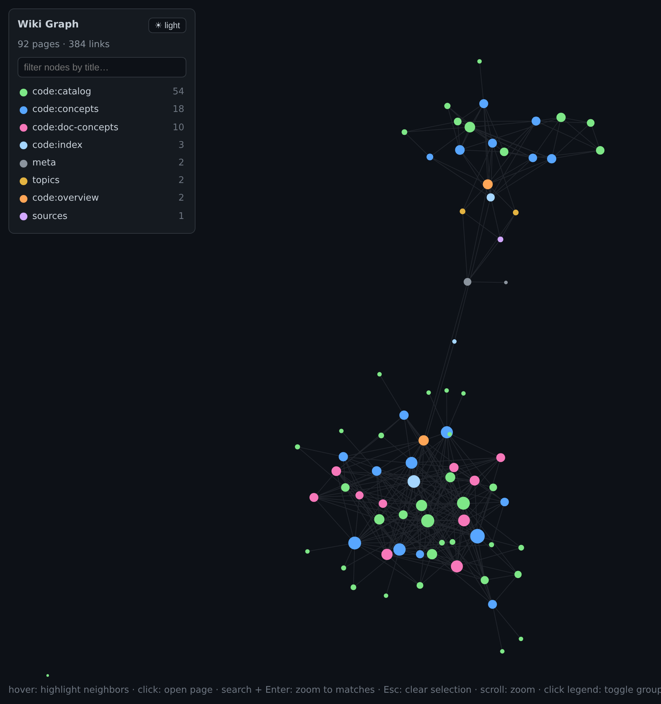

# 🧠 wikify repo

**Compile any codebase into a knowledge base wiki your AI agent can actually trust.**

**wikify-repo** turns a repo into a grounded, lint-clean [**Andrej Karpathy style LLM markdown wiki**](https://gist.github.com/karpathy/442a6bf555914893e9891c11519de94f) where every claim is traced to
a real, compiler-resolved symbol — behind a citation linter that fails the build if one doesn't
check out. No graph database, no dashboard, no hosted service: the output is plain markdown your agent
answers from with `grep`, and that you own in your own git repo. Deterministic tool does the
grounding (SCIP symbol graph, packets, citation lint); one LLM-in-the-loop step does the synthesis.

The idea is simple: record every class, method, and their relationships with SCIP, then spend the LLM annotating only the most central ~20% of nodes — enough to explain ~80% of the repo, while the rest still get a deterministic catalog page so nothing is dropped.

## How wikify-repo compares

| | [**wikify-repo**](https://github.com/vlasenkoalexey/wikify-repo) | [openwiki](https://github.com/langchain-ai/openwiki) | [graphify](https://github.com/Graphify-Labs/graphify) | [understand-anything](https://github.com/Egonex-AI/Understand-Anything) | [Google Code Wiki](https://developers.googleblog.com/introducing-code-wiki-accelerating-your-code-understanding/) |
|---|---|---|---|---|---|
| **Specialization** | Grounded markdown wiki you own — for trusted agent retrieval | Agent-written docs — an LLM reads the repo and writes the pages | Multi-modal knowledge graph (code + docs + media) | Visual codebase onboarding — explore it as a graph | Zero-setup hosted docs for public repos |
| **Output** | ✅ Markdown wiki — pages in your git repo | ✅ Markdown docs — pages in your git repo | ➖ Knowledge graph (HTML + JSON) | ➖ React-Flow graph dashboard | ❌ Hosted web docs only |
| **Code structure from** | ✅ **SCIP** — compiler-grade symbol resolution (scip-python / scip-clang). **Full semantic mapping** | ❌ **nothing** — no parser at all; the LLM reads source with filesystem + shell tools | ➖ tree-sitter AST, **name-based** (20 languages). Syntactic mapping. | ➖ tree-sitter AST, **name-based**. Syntactic mapping. | ❔ Gemini (closed) |
| **Faithfulness** | ✅ **Citation linter is a hard build gate**; uncited → `[!inferred]` | ❌ **prompt directive only** — a ~130-line system prompt, no gate, no citations | ➖ `EXTRACTED / INFERRED / AMBIGUOUS` labels — honest, not gated | ❌ LLM per-node summaries, unverified | ❌ *"AI-generated map, not a source of truth"* |
| **Coverage** | ✅ **Deterministic set-difference** — every module gets a page | ❔ whatever the agent chooses to visit — unbounded | ➖ Leiden community clustering | ➖ analyzes discovered files — no stated completeness | ❔ not specified |
| **Inputs** | ➖ code + prose (docs / articles) | ➖ code repos only | ✅ **widest** — code, SQL, shell, docs, papers, images, audio/video | ➖ code + docs / LLM-wikis | ➖ code repos only |
| **Retrieval** | ✅ `grep` + `index.md` — **no embeddings, no DB, no additional tools** | ✅ `grep` over markdown — no embeddings, no DB | ➖ graph queries + clusters (no embeddings) | ➖ name + semantic search in the dashboard | ➖ hosted UI + Gemini chat — no MCP / API |
| **Updates** | ✅ **idempotent reconcile** — `--ref` rebuilds only changed *symbols* | ✅ incremental — git-diff since the last run's `gitHead`, then an LLM edits the affected pages | ✅ `--update` re-extracts only changed *files* (caches semantic passes) | ✅ incremental — re-analyzes only changed *files* | ✅ auto-maintained (hosted) |
| **Ownership** | ✅ plain markdown in your repo — offline, git-diffable | ✅ plain markdown in your repo — offline, git-diffable | ➖ local graph files | ➖ local dashboard | ❌ **Google-hosted** (private repos waitlisted) |

<sub>✅ strong · ➖ partial / trade-off · ❌ weak or absent · ❔ unknown / closed</sub>

The other four optimize for something else — a graph to traverse ([graphify](https://github.com/Graphify-Labs/graphify)),
a visual dashboard to explore ([understand-anything](https://github.com/Egonex-AI/Understand-Anything)),
a zero-setup hosted site ([Google Code Wiki](https://developers.googleblog.com/introducing-code-wiki-accelerating-your-code-understanding/)),
and — closest of all — agent-written markdown you own ([openwiki](https://github.com/langchain-ai/openwiki)).
openwiki is the sharpest comparison, because it shares the two things that matter most here: the output
is markdown in your repo, and retrieval is nothing but `grep`. What it does not share is the gate — it
has no parser and no citations, so grounding is a *prompt instruction* and nothing fails when a claim
does not check out.
**wikify-repo** optimizes for **trust and ownership**: every claim cites a resolved symbol behind a hard
gate, a deterministic coverage pass guarantees no module is silently dropped, and the result is plain
markdown an agent reads with **nothing but `grep`** — no runtime, no database, no SaaS. For retrieval, **you don't even need this repo**, just a few changes to your CLAUDE.md/AGENTS.md to instruct agent to navigate code wiki.

## SCIP vs AST parsing

Most code-knowledge tools (graphify, understand-anything) parse with [**tree-sitter**](https://tree-sitter.github.io/tree-sitter/) — a fast,
build-free [**AST**](https://en.wikipedia.org/wiki/Abstract_syntax_tree) (abstract syntax tree), one tree per file. Great for breadth (20+ languages, no toolchain), but it resolves
references syntactically **by name**: it sees a call to something *called* `forward`, not *which* `forward`.
Cross-file bindings, import aliases, inheritance/overrides, and overloads are guesses.

**wikify-repo** indexes with [**SCIP**](https://github.com/sourcegraph/scip) (Sourcegraph's Code Intelligence Protocol) via `scip-python`
(pyright) and `scip-clang` (clang) — the language's *real* name-and-type resolver. Every definition
and reference binds to a globally-unique **moniker**, so a citation points at *the* symbol, across
files — not a string that happens to match. That's what makes grounding *enforceable*: a claim's
`cite:` either resolves to a real symbol in the SCIP table, or the **linter fails the build**.

Honest tradeoffs: SCIP needs a real indexer (`scip-python` over npm; a `compile_commands.json` for
C++) — heavier than a zero-build parse, which is the price of precision. Tree-sitter trades that precision for breadth: the right
call for navigation, the wrong one for *citeable* grounding.

Because grounding is SCIP (language-neutral), **languages are pluggable**: Python + C++ are built in;
**TS/JS, Go, and Rust** use their own SCIP indexers. All indexers are installed *on demand* — `prepare`
detects the language and installs what it needs into a user prefix rather than bundling everything up front.

## Why use a wiki as the storage format

The consumer is an **AI agent**, and agents already read markdown and retrieve with `grep` / `ripgrep`
natively — no query language, no graph runtime, no vector index, no MCP server, even no skill. **The output is the
interface.** Drop `wiki/` into a repo and any agent (Claude Code, Codex, Antigravity) answers from it
with zero adapter.

Honest tradeoff: a graph DB wins at arbitrary transitive queries ("every transitive caller of `X`").
wikify's answer is to **materialize** the common ones into the pages — per-symbol uses-by lists,
per-module catalogs — so the frequent questions are already answered as text, and the rare deep query
drops to the pinned source. For *agent retrieval of internals knowledge*, materialized markdown beats
a live graph you have to query.

Pages carry [OKF v0.2](https://github.com/GoogleCloudPlatform/knowledge-catalog/blob/main/okf/SPEC.md)
front matter (`generated`, `verified`, file-level `sources`), so a reader can tell agent-generated from
human-reviewed pages without knowing anything wikify-specific.

## Demo and template

**[wikify-repo-demo](https://github.com/vlasenkoalexey/wikify-repo-demo)**
is a live, populated wiki *produced by this tool* — two real codebases
([`mini_pytorch_xla`](https://github.com/vlasenkoalexey/wikify-repo-demo/blob/main/wiki/code/mini_pytorch_xla/overview.md)
and wikify-repo itself) plus prose pages, all grounded, cited, and cross-linked.

[](https://vlasenkoalexey.github.io/wikify-repo-demo/tools/graph/)
(click image for interactive view)

It plays two roles:

- **Showcase** — browse a finished wiki end to end (`overview.md` → `concepts/` → `catalog/` → the pinned source) to see exactly what wikify-repo emits and how an agent answers from it.
- **Template** — click **"Use this template"** (or start from the empty [`clean`](https://github.com/vlasenkoalexey/wikify-repo-demo/tree/clean) branch) to get a new repo with the `wikify-ingest-repo` skill and the `SCHEMA.md` / `CLAUDE.md` / `AGENTS.md` / `GEMINI.md` agent conventions already wired in — then just `ingest <your-repo>`.

But it is important to note that wikify-repo can be integrated into any LLM wiki project.

## Install

**Prerequisites:** Python ≥ 3.11 and `git`. Node.js + npm only if you index Python or TS/JS
(their SCIP indexers are npm packages); the C++ indexer is a downloaded binary.

```bash
# A — no checkout:
pipx install git+https://github.com/vlasenkoalexey/wikify-repo
# B — from a checkout (development):
git clone https://github.com/vlasenkoalexey/wikify-repo && cd wikify-repo && pip install -e .

wikify setup          # installs the wikify-ingest-repo skill for Claude Code (~/.claude/skills)
wikify doctor         # what is installed, and the fix for anything missing
```

`wikify setup` is idempotent. The skill ships inside the package; `wikify setup --project <dir>`
also installs it into a project's `.agents/skills/` (what **Codex** and **Antigravity** read) with
a `.claude/skills/` symlink. Indexers (`scip-python`, `scip-clang`, TS/JS, Go, Rust) are installed
into `~/.wikify/vendor` on the first `wikify prepare` that needs them, announced and opt-out;
`wikify setup --indexers python,cpp` prefetches them.

The CLI does the deterministic stages; the page-writing (synthesis) stage is **LLM-in-the-loop**, so
an agent runs the `wikify-ingest-repo` skill — one self-contained, tool-neutral markdown procedure
that works in Claude Code, Codex, and Antigravity.

## Quick start

wikify has a **producer** side (build/maintain the wiki — needs the install) and a **consumer** side
(answer from it — needs nothing). The wiki can live in one of two places.

### In-repo: the wiki lives with the code

```bash
cd my-repo && wikify init        # writes wikify.md, .gitignore (.wikify/), and a wikify block in
                                 # CLAUDE.md + AGENTS.md telling agents where the wiki is
# then, in your agent: "wikify this repo"
```

```
my-repo/
  wikify.md        config (slug, wiki_dir, docs/tests globs, synthesis_focus, agenda tuning)
  wiki/            overview.md, index.md, log.md, concepts/, catalog/, doc-concepts/, changes/
  .wikify/         cache: packets, SCIP index, state, verify holds (gitignored)
  CLAUDE.md        <!-- wikify:begin --> ... <!-- wikify:end -->   (same block in AGENTS.md)
```

The pin is the repo's own `HEAD` at each ingest, so a re-run after new commits is the version bump:
changed symbols rebuild, moved ones relink, and `wiki/changes/<ref>.md` records what changed and why.
A knowledge base can then pin such a repo as a submodule and get its matching wiki for free.

### Host wiki: many repos, one wiki

A separate **Karpathy-style wiki repo** carrying the skill, the agent conventions, and the committed
`wiki/`: one `config/<slug>.md` per ingested repo, sources under `raw/code/<slug>` (submodule or
clone), silos under `wiki/code/<slug>/`, and cross-repo concept pages on top (`wikify connect`).

```bash
git clone -b clean https://github.com/vlasenkoalexey/wikify-repo-demo my-wiki   # empty template
wikify setup --project my-wiki      # or any existing project: wikify setup --project <dir>
```

Open the project in your agent and say:

> ingest https://github.com/owner/myrepo      (a local path works too)

The agent runs the `wikify-ingest-repo` procedure — bootstrap config → index → symbol graph → write the
concept pages → citation lint → assemble — and writes the wiki to `wiki/code/<slug>/`. Re-running is
idempotent: only changed concepts rebuild. This slots into **any existing LLM-wiki project** as the
*code* source type, next to prose pages, sharing one `index.md` / `log.md` (what the
[demo](https://github.com/vlasenkoalexey/wikify-repo-demo) does).

### Answer from a wiki — no install needed

To let an agent answer from a wiki — one you built, or one someone else committed — you need **nothing
installed**: no `wikify` CLI, no skill, no indexer. Commit the `wiki/` folder and tell the agent to
retrieve from it (`wikify init` writes this block for you; for a host wiki, add it to **`CLAUDE.md`**,
**`AGENTS.md`**, and/or **`GEMINI.md`**, or to a shared **`SCHEMA.md`** they all point at):

```markdown
## Codebase wiki — source of truth
A grounded wiki for <repo> lives at `wiki/code/<slug>/`. To answer questions about its internals,
**retrieve from the wiki instead of reading source**:
- Read `wiki/code/<slug>/overview.md` first — it maps concepts to pages.
- `grep` the wiki to find the relevant `concepts/` (mechanism) or `catalog/` (per-symbol) page; read
  only that section.
- Cite the catalog anchor `catalog/<module>.md#<Symbol>`; follow its source link only when you need
  the exact line.
- Don't bulk-read whole pages, and don't guess — every claim should trace to a cited symbol.
```

The markdown *is* the interface — that's the whole integration.

## Architecture

The deterministic stages are pure Python with zero model calls — SCIP parse, reconcile diff, packet
build, coverage, citation lint — and the LLM is invoked at exactly one step, concept synthesis (plus
concept-link judgment). The model proposes prose; Python decides what is true. The rationale and the
decisions log are in [docs/design.md](docs/design.md); the stage-by-stage mechanics, config keys and
CLI surface are in [docs/implementation.md](docs/implementation.md).
